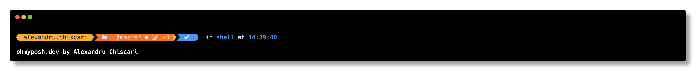

# POSH theme

## adynetro



## Installation
Install ohmyhposh from <https://ohmyposh.dev/> and Meslo LGM NF nerd font <https://github.com/ryanoasis/nerd-fonts/releases/download/v2.1.0/Meslo.zip>

```posh
Install-Module oh-my-posh
Import-Module oh-my-posh
```

clone the repo inside home folder

```posh
Set-PoshPrompt -theme "~\posh\.adynetro.omp.json"
```

add poshprompt to ```$PROFILE``` and reload the terminal
